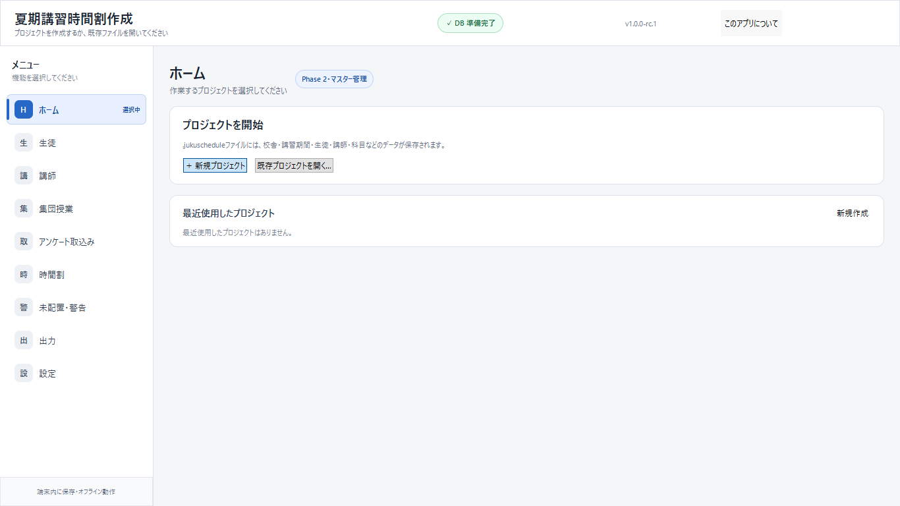

# 夏期講習時間割作成アプリ

[](https://github.com/SotaFurukawa/SeminarSched/actions/workflows/ci.yml)
[](LICENSE)

夏期講習などの不定期講習を対象とした、Windows向けの完全ローカル型デスクトップ
アプリです。UIにはPySide6とQML、データ保存にはSQLiteとSQLAlchemy 2を使用します。

[Unsigned distribution policy](docs/code_signing_policy.md) |
[Privacy policy](PRIVACY.md) |
[Security policy](SECURITY.md)

現在のアプリ版は **v1.3.4** です。Phase 1の
起動基盤、Phase 2のプロジェクト・マスター管理、Phase 3のアンケート・集団授業・
入力検証、Phase 4のハード制約を破らない自動配置を維持しつつ、時間割グリッド、
ドラッグ＆ドロップの即時検証、ロック、Undo / Redo、差分・監査、自動保存、
ロック以外の全体再最適化に加え、共通レイアウトからのExcel・PDF・CSV出力を
追加しています。Phase 7では自動バックアップ世代管理、破損検出と安全な復元、
版表示、Windowsポータブル版・インストーラー・SHA-256を作る配布基盤、性能・
運用・受入文書を追加しました。

Phase 4の最適化画面はPhase 5の編集画面から開けます。「出力」では全体、生徒別、
講師別、未配置・警告のExcel / PDFと割当て生データCSVを生成できます。選択日・選択生徒・
選択講師だけの部分再最適化は、安全な
境界が確定するまで提供していません。

## スクリーンショット



この画像は2026-07-29に、利用者データ・最近使用したproject・既存logを読み込まない
一時保存先でsource版を起動して取得したものです。

刷新後のホーム画面は
[`docs/ui_redesign/screenshots/ui_after_home_1366x768.png`](docs/ui_redesign/screenshots/ui_after_home_1366x768.png)
です。こちらも個人データを読み込まない一時保存領域で取得しています。

## 画面の基本フロー

刷新UIでは、ホームとサイドバーに次の4段階を常時表示します。

1. 共通名簿を確認し、授業日・コマを設定する
2. 生徒・講師アンケートをまとめて取り込む
3. 集団授業を確認し、時間割を自動作成・編集する
4. 全体・講師別・生徒別のExcel / PDFを出力する

ホームの`生徒・講師_基本情報.xlsx`は講習間で共通です。在籍情報、指導可能科目、
通常授業の担当をここで編集し、新規講習には自動反映します。退籍者は削除せず
在籍チェックを外した状態で灰色・末尾に保持します。日常的な少人数追加にはアプリ内の
個別登録も使えます。在籍はA列のセル内チェックボックスをワンクリックして切り替えます。
姓を入力すると、ID・在籍・
最大連続2・空きなしの既定値を表示し、アプリ反映時に衝突しないIDへ確定します。
セル内チェックボックスの表示と操作にはMicrosoft 365またはExcel 2024以降が必要です。
古いExcelでは同じ値が`TRUE`／`FALSE`で表示されます。
集団授業は週カレンダー、時間割編集は未配置・時間割・
選択詳細の3ペインです。出力は対象、形式、保存先の順に進み、詳細な帳票設定は必要な
場合だけ開きます。詳細は[`docs/user_manual.md`](docs/user_manual.md)を参照してください。

①で開校日とコマを設定した後、②の「Googleフォームを作る」から、生徒用・講師勤務日時用・
講師指導可能科目用のGoogle Apps Scriptと作成手順を一括出力できます。講師用ではメール
アドレスを収集しません。アプリはGoogleへ直接接続せず、回答や個人情報もスクリプトへ
書き出しません。

回答後は生徒回答と講師回答のCSV／xlsxを「おすすめ：まとめて取り込む」へそれぞれ
1回ずつ指定します。基本情報にない在籍生・講師は赤、フォームで体験生と回答した生徒は
黄で表示します。反映時は2原本と要確認一覧を含む統合xlsxを`.jukuschedule`内へ保存します。

## 利用者向けダウンロード

配布責任者が公開内容を承認した公式GitHub Releaseでは、次の3ファイルを同じReleaseから
取得します。第三者が再配布した単独の`.exe`は使わないでください。

- `SummerCourseScheduler-Setup-1.3.4.exe`
- `SummerCourseScheduler-Portable-1.3.4.zip`
- `SHA256SUMS.txt`

ダウンロード後は、同梱一覧と実ファイルのSHA-256を照合します。

```powershell
Get-FileHash .\SummerCourseScheduler-Setup-1.3.4.exe -Algorithm SHA256
Get-FileHash .\SummerCourseScheduler-Portable-1.3.4.zip -Algorithm SHA256
```

### インストーラー版

1. installerと`SHA256SUMS.txt`を同じ公式Releaseから取得し、hashを確認する。
2. installerを起動する。利用者単位の既定先は
   `%LOCALAPPDATA%\Programs\SummerCourseScheduler`で、管理者権限を要求しない。
3. Start menu shortcut、または選択したdesktop shortcutから起動する。
4. uninstallしても、`%LOCALAPPDATA%\SummerScheduler`以下の設定・log・backupや、
   利用者が選んだ`.jukuschedule`は自動削除しない。

`.jukuschedule`の関連付けはこのRelease候補では登録しません。アプリを起動して
「既存プロジェクトを開く」から選択してください。

### ポータブル版

1. ZIPと`SHA256SUMS.txt`を同じ公式Releaseから取得し、hashを確認する。
2. ZIPを任意のローカルフォルダーへすべて展開する（展開操作にはそのフォルダーへの
   書込み権が必要）。ZIP内のexeだけを直接起動したり、一部のDLLやQMLを移動したり
   しない。展開完了後のアプリ本体フォルダーはread-onlyでも実行できる。
3. 展開した`SummerCourseScheduler\SummerCourseScheduler.exe`を起動する。

portable版はアプリ本体フォルダーへ利用者データを書き込みません。設定、app DB、
log、自動backupは`%LOCALAPPDATA%\SummerScheduler`へ保存するため、この利用者領域と、
利用者が選ぶproject／出力先に書込み権が必要です。プロジェクトや出力をUSB等へ
置く場合も、書込み可能で安全に取り外せる場所を選んでください。

### 初回起動とSmartScreen

初回起動時にapp管理SQLite DB、設定用directory、logを利用者領域へ作り、日本語の
ホーム画面を表示します。最初に「新規プロジェクト」または「既存プロジェクトを開く」
を選びます。初めて利用する場合は
[`docs/quick_start_guide.md`](docs/quick_start_guide.md)、詳しい業務手順は
[`docs/user_manual.md`](docs/user_manual.md)を参照してください。Googleフォームの
質問例と回答の整形方法は
[`docs/google_forms_questionnaire_guide.md`](docs/google_forms_questionnaire_guide.md)
にまとめています。通常は②の「Googleフォームを作る」で現在の講習設定を反映した
生徒用・講師用スクリプトを一括出力します。`tools/google_forms`内のスクリプトは、
開発・確認用の固定例としても利用できます。

このリリース候補はコード署名していないため、Windows SmartScreenで発行元不明の
警告が表示される可能性があります。Windowsの保護機能や組織policyを恒久的に無効化
しないでください。公式Releaseの取得元、ファイル名、SHA-256を確認し、所属組織の
許可がある場合だけWindowsの案内に従います。解決しない場合は
[`docs/troubleshooting.md`](docs/troubleshooting.md)を参照してください。

### 未署名配布方針

社内利用向け成果物は意図的に未署名で配布します。SignPath申請は終了しており、今後の
リリース操作に署名要求や証明書設定はありません。公式ReleaseとSHA-256を確認し、利用
組織の許可を得たPCだけで使用してください。詳細は
[`docs/code_signing_policy.md`](docs/code_signing_policy.md)を参照してください。

## 仕様と設計文書

公開版の機能仕様と制約は
[`docs/specification.md`](docs/specification.md)、アーキテクチャと開発方法は
[`docs/developer_guide.md`](docs/developer_guide.md)、主要な技術判断は
[`docs/adr/`](docs/adr/)にまとめています。最適化のハード制約を、実装上の都合で
ソフトな減点へ変更しないことを開発上の原則とします。

業務上の参考PDF、Excel、実データはアプリの実行・テスト・ビルドに不要であり、
個人情報を含む可能性があるためGitの追跡対象外です。

## Phase 7リリース候補で確認できること

- `python -m summer_scheduler` または `summer-scheduler` による起動
- 日本語タイトルのPySide6/QMLメインウィンドウ
- 各機能への導線を示すサイドバー
- プロジェクトの新規作成、再読込み、最近使用したファイル、別名保存、複製、
  バックアップ、クローズ
- 1ファイル1プロジェクトの `.jukuschedule`（内部形式はSQLite）
- ホームから編集できる、講習に依存しない`生徒・講師_基本情報.xlsx`
- 在籍／退籍、姓・名、学年、指導可能科目、通常授業担当の講習間共通管理
- 生徒・講師Googleフォーム回答2ファイルの一括照合・取込み・統合xlsx内包
- プロジェクト名、校舎名、講習期間の編集
- Y / Z / A / B / Cの初期コマと、コマ名・時刻・順序・使用可否の編集
- 講習期間内の開校日・休校日・備考と一括設定
- 小学校7科目、中学校5科目、高校14区分の初期科目
- 生徒・講師の検索、追加、編集、使用停止、削除
- 講師×科目の指導可否と、生徒×科目の受講希望
- `master_data.xlsx` の出力、検証プレビュー、確認後の一括反映
- 生徒用・講師用availabilityテンプレートと0／1／2の入力規則
- アンケートブック内の生徒・講師・科目マスター参照、ID選択、名前・科目名確認
- 必須列表示、Excel学年のS1～S6／J1～J3／H1～H3選択、業務上安全な空欄既定値
- xlsx／UTF-8 CSV／CP932 CSVのシート・文字コード・列マッピング・先頭プレビュー
- ID、名前、期間、開校日、科目、LessonRequest、希望講師資格等の検証
- 追加・変更・変更なし・削除候補のセル差分と、明示選択時だけの削除
- 通常担当講師、優先度5、1対1契約をアンケートから上書きしない保護
- 任意の開始・終了時刻を持つ集団授業と受講者の2シート取込み
- 半開区間による講師・生徒の集団授業衝突検証
- ImportBatch、AuditLog、ValidationIssueによる取込み・検証記録
- 生徒10名、講師5名等を含む架空名だけの匿名サンプル生成
- 初回起動時のアプリ管理SQLite DB初期化
- SQLAlchemy 2によるDB接続とAlembicによるマイグレーション方針
- YAML設定の読込み
- ローカルファイルへの技術ログ出力
- pytest、Ruff、mypy、GitHub Actionsによる品質検査の土台
- app versionとAlembic schema revisionを分けたAbout・log・帳票表示
- project open直後と既定5分間隔の自動backup、project別5世代管理
- SQLite整合性・書込み可否の確認、異常終了／open失敗後の復旧候補、
  復元前退避を必須とする原子的復元
- portable ZIP、Inno Setup installer、SHA-256を同じstandalone treeから作る配布基盤
- runtime依存license収集、性能記録、最終受入表、release checklist
- SQLAlchemy ORMやQMLへ依存しない、不変な最適化DTOとJSONスナップショット
- 開校日、有効コマ、0／1／2のavailability、講師資格、優先度5、集団授業、
  固定授業を考慮した疎な候補生成
- 必要回数ごとの配置または未配置、生徒重複禁止、講師最大2名、1対1必須、
  生徒・講師の空きコマ禁止、生徒の連続上限等をCP-SATのハード制約として適用
- 未配置数を最優先にした段階的な辞書式最適化
- 最終ソフト目的による、勤務可能枠に対する講師参加割合の偏り抑制
- 高速30秒、標準120秒、高品質600秒のプリセットと、実行中の安全な中断
- solver status、配置・未配置件数、目的関数内訳、未配置理由、警告の簡易表示
- 最適化入力のfingerprint再照合、保存前の独立結果検証、Assignmentと
  OptimizationRunのtransaction保存
- Alembic revision `20260728_0004`によるAssignmentとOptimizationRunの追加
- 日付×コマ×講師の時間割編集画面と、当日5コマ×講師列だけを保持する
  `QAbstractTableModel` / QML `TableView` の再利用表示
- 前日・翌日、日付タブ、カレンダー、日表示、複数日サマリー、拡大縮小
- 生徒・講師検索、学年・科目・1対1・優先度5・警告・ロック・未配置の絞込み
- 生徒名、学年、科目、1対1、優先度5、ロック、手動変更、警告を示す授業カードと、
  集団授業ブロック、詳細・履歴パネル
- 配置済みカードまたは未配置カードの、別日・別コマ・別講師への
  ドラッグ＆ドロップ
- Phase 4と同じ独立validatorによるドロップ前検証。ハード制約違反は赤で拒否し、
  管理者強制経路を設けない
- ソフト条件悪化は黄で、通常担当・希望講師・希望日時・1対2・稼働講師枠・
  既存配置変更等の前後差を表示し、理由付き確認後だけ反映
- 未配置授業の残り回数、主な理由、候補数と、同じ検証境界を使う再配置
- 日付・コマ・講師・授業単位ロック・備考の詳細編集と、配置から未配置への変更
- AssignmentとAuditLogを1トランザクションで保存する操作後の自動保存。保存失敗時は
  rollbackし、日本語で通知
- 即時保存済みSQLiteの整合したbackupを明示保存点として作る「手動保存」と、
  保存先・個人情報を含み得る旨の表示
- fingerprint付きプロセス内コマンド履歴による移動、未配置化、再配置、ロック、
  備考等のUndo / Redoと、操作理由・変更前後・手動／Undo／Redoを残す監査ログ
- 手動変更前後、および再最適化checkpoint前後の新規配置・日時・講師・未配置・
  1対1／1対2変化・変更なしの差分
- 対象配置数、ロック数、未配置数を確認し、SQLite backup checkpointを作ってから
  Phase 4最適化画面で行う「ロック以外を全体再最適化」
- Alembic revision `20260729_0005`によるAssignment備考とAuditLogの理由・操作元・
  operation IDの追加
- ORMやQMLに依存しない出力スナップショット、共通`LayoutDocument`、帳票別builder
- 全体時間割、生徒別、講師別、未配置・警告の編集可能な`.xlsx`
- Qtのローカル描画だけで生成するA3 / A4・縦横対応PDFとQtQuick.Pdfプレビュー
- 日付、講師、生徒の出力対象選択、ページ送り、50～300%の拡大縮小
- 用紙、向き、日数、講師列数、文字サイズ、余白、表示項目、色＋文字記号、
  ファイル名規則、既定出力先、生徒別改ページ、CSV BOMのプロジェクト別保存
- 校舎マスターを正本とするロゴ設定（PDFヘッダーへ表示。Excelへは画像を埋め込まない）
- 18列の割当て生データCSV、UTF-8 BOM有無、個別授業・集団授業、数式注入対策
- 出力直前の最新DB再読込みと独立ハード制約検証、未配置理由と単独配置可能候補
- 同名上書き確認、同一ディレクトリ一時ファイルと原子的置換、日本語の権限エラー
- Alembic revision `20260729_0006`によるプロジェクト別出力設定

QMLは表示とユーザー操作に限定し、DBアクセス、業務ロジック、最適化処理、
入出力処理はPython側の独立した層へ配置します。

## 対象環境

- Windows 10 / 11（x64）
- Python 3.12系（`>=3.12,<3.13`）
- PowerShell

sourceから開発・testする場合はPython 3.12が必要です。installer / portableは
Python、Node.js、Qt SDKを利用者PCへ要求しないstandalone構成です。実際のclean
Windows受入状態は[`docs/acceptance_test_phase7.md`](docs/acceptance_test_phase7.md)
を確認してください。

## Windowsでの開発環境構築

PowerShellでリポジトリ直下へ移動し、次を実行します。

```powershell
py -3.12 -m venv .venv
.\.venv\Scripts\Activate.ps1
python -m pip install --upgrade pip
python -m pip install -e ".[dev]"
```

PowerShellの実行ポリシーにより有効化できない場合は、現在のプロセスだけ許可するか、
仮想環境内のPythonを直接指定できます。

```powershell
Set-ExecutionPolicy -Scope Process RemoteSigned
.\.venv\Scripts\Activate.ps1
```

## 起動

仮想環境を有効にして、次のいずれかを実行します。

```powershell
python -m summer_scheduler
```

```powershell
summer-scheduler
```

初回起動時に、DBとログに必要なローカル領域が初期化されます。既定の保存先は次の
とおりで、リポジトリ内へ実データを作らない設計です。

| 種類 | 既定パス |
|---|---|
| アプリ管理DB | `%LOCALAPPDATA%\SummerScheduler\data\summer_scheduler.db` |
| ログ | `%LOCALAPPDATA%\SummerScheduler\logs\summer_scheduler.log` |
| 自動・migration前・復元前バックアップ | `%LOCALAPPDATA%\SummerScheduler\backups\` |
| 任意のユーザー設定 | `%LOCALAPPDATA%\SummerScheduler\config.yaml` |

アプリ管理DBは最近使用したプロジェクト等のアプリ状態だけを保持します。生徒名や
受講希望などの業務データは、利用者がGUIで保存先を選ぶ `.jukuschedule` ファイルへ
保存されます。両者を同じDBとして扱わないでください。

アプリ内蔵の既定設定を先に読み、ユーザー設定が存在する場合に上書きします。保存先の
基点は `platformdirs` で解決します。

設定例は `config.example.yaml` です。必要な項目だけを変更し、上表のユーザー設定
パスへコピーします。別の設定を一時的に使う場合は、次のように明示できます。

```powershell
python -m summer_scheduler --config .\config.example.yaml
```

## プロジェクトの基本操作

1. 「ホーム」の「新規プロジェクト」から、プロジェクト名、開始日、終了日を入力します。
   保存先はアプリの標準プロジェクトフォルダーへ自動的に決まります。
2. 作成直後に既定の5コマ、26科目、期間内の開校日が登録されます。
3. 初期名簿は「生徒」「講師」のExcel一括追加・更新から登録します。設定では
   プロジェクト情報、コマ、開校日・休校日、科目、Excel入出力を扱います。
4. 別ファイルへ切り替える場合は「既存プロジェクトを開く」または「最近使用した
   プロジェクト」を使います。

「名前を付けて保存」は現在の内容を別ファイルへ保存し、そのファイルへ切り替えます。
「複製」はコピーを作りますが、開いているファイルは切り替えません。「バックアップ」
もコピーを作り、元ファイルを開いたままにします。保存先には個人情報が含まれ得ます。

古いschemaのプロジェクトを開く際は、Alembic migrationを適用する前に自動バック
アップを作成します。通常のファイル操作でも、同期中のSQLiteをエクスプローラーから
直接コピーするのではなく、アプリの別名保存・複製・バックアップを使用してください。

プロジェクトopen直後と実行中の設定間隔ごとに、既定5世代の自動バックアップを
作成します。ホームではSQLite整合性、異常終了・open失敗後の復旧候補を確認し、
選択backupから復元できます。復元は現在fileの復元前backupを作れた場合だけ原子的に
置き換えます。間隔と世代数は`config.example.yaml`の`backup`で変更できます。
バックアップにも元projectと同じ個人情報が含まれます。

詳細な画面確認手順は
[`docs/manual_test_phase2.md`](docs/manual_test_phase2.md)を参照してください。
Phase 3の取込み・集団授業・入力検証は
[`docs/manual_test_phase3.md`](docs/manual_test_phase3.md)を参照してください。
Phase 4の最適化画面とWindows実機での中断・結果保存確認は
[`docs/manual_test_phase4.md`](docs/manual_test_phase4.md)を参照してください。
Phase 5の時間割表示、ドラッグ＆ドロップ、ロック、Undo / Redo、再最適化、DPI、
キーボード、40講師×5コマの画面性能確認は
[`docs/manual_test_phase5.md`](docs/manual_test_phase5.md)を参照してください。
Phase 6のプレビュー、Excel / PDF / CSV、上書き・権限、日本語パス、ロゴ、設定保存は
[`docs/manual_test_phase6.md`](docs/manual_test_phase6.md)を参照してください。
Phase 7の異常終了、破損、OneDrive競合、read-only、容量、権限、長いpath、backup復元は
[`docs/manual_test_phase7_data_safety.md`](docs/manual_test_phase7_data_safety.md)を、
利用者向けの通し手順は[`docs/user_manual.md`](docs/user_manual.md)を参照してください。

## マスターExcelの入出力

プロジェクトを開き、「設定」→「Excel入出力」から操作します。

- 出力形式は `master_data.xlsx` です。
- シートは「生徒」「講師」「科目」「講師対応科目」「受講希望」の5枚です。
- 1行目は日本語ヘッダー、2行目は架空の例示行です。「例示行」が「はい」の行は
  再取込み時に無視されます。
- 真偽値は原則「はい／いいえ」で入力します。IDは名前ではなく安定した文字列IDを
  使用します。
- 参照IDは直接入力でき、隣の確認列へ名前が表示されます。「名前から選択」の
  プルダウンから選び、正式なIDを自動表示する入力方法も利用できます。
- 生徒の標準最大連続コマ数、空きコマ許可、有効が空欄の場合は、順に`2`、
  `いいえ`、`はい`として取り込みます。
- 入力規則、列説明、参照IDの選択肢、フィルター、固定ヘッダーを含みます。
- 取込み時は必須シート・列、型、重複、参照ID、優先度、講師資格等を行単位で検証し、
  シート、行番号、列名、新規／更新件数を反映前に表示します。
- エラーが1件でもあるプレビューは反映できません。警告だけの場合は、内容を確認して
  から反映できます。
- 確認後の反映は1トランザクションで行い、途中エラー時は全体をロールバックします。

Excelを外部で編集する際は、シート名とヘッダー名を変更しないでください。ファイルを
開いたまま出力先へ上書きするとWindows側のロックで失敗するため、Excelを閉じてから
再実行してください。本機能はマスター情報の一括入出力であり、Phase 3の日時
アンケート取込みウィザードではありません。列ごとの仕様とエラー／警告の区別は
[`docs/master_data_excel.md`](docs/master_data_excel.md)を参照してください。

## アンケート・集団授業・入力検証

「アンケート取込み」では、生徒または講師のxlsx / CSVを選び、xlsxのシート、CSVの
文字コード、入力列と保存先項目の対応を確認してから検証します。生徒テンプレートは
科目コードと第1～第3希望講師を含みますが、通常担当、優先度5、1対1契約は塾側
マスターとして保護され、アンケートから変更できません。

アプリが生成したGoogleフォームを使う場合は、画面上部の一括取込みを推奨します。
生徒回答と講師回答をそれぞれ選び「まとめて検証」を押すと、氏名・学年を共通名簿と照合し、
最大4科目の必要回数と日付別の不可コマを正規化します。基本情報にない在籍生・講師は
赤いエラー、体験生は黄色い警告です。エラーがなければ1回の操作で反映し、原本2つと
`講習アンケート統合.xlsx`をプロジェクト内に保存します。従来の列マッピング方式は、
独自様式や過去形式を取り込む場合に使用します。

差分には追加、変更、変更なし、削除候補、エラー、警告を表示します。入力ファイルに
存在しない既存行は自動削除せず、「削除候補も反映」を明示選択して確認した場合だけ
削除します。反映直前にファイルを再読込み・再検証し、業務データ、ImportBatch、
AuditLogを1トランザクションで保存します。

「集団授業」では `group_lessons.xlsx` の「集団授業」「受講者」2シートを取り込み
ます。Y/Z/A/B/Cと完全一致しない時刻も使用でき、時間区間は `[開始, 終了)` として
判定します。ある授業の終了と次の開始が同じだけなら重複ではありません。

「未配置・警告」では保存済みプロジェクトを再検証し、エラー、警告、情報を区別して
ValidationIssueへ保存します。エラーがある状態はPhase 4の最適化入力として使用
できません。

## 時間割の自動作成と編集

プロジェクトを開き、入力検証エラーを解消してから「時間割」を開きます。最初に
Phase 5の時間割編集画面が表示されます。まだAssignmentがない場合、または現在の
時間割を作り直す場合は「ロック以外を再最適化」を選びます。

1. 事前確認で対象配置数、ロック数、未配置数、変更可能件数を確認する。
2. 続行すると現在の`.jukuschedule`のcheckpoint backupを作り、Phase 4の最適化画面へ
   移動する。バックアップ失敗時は最適化画面へ進まない。
3. 高速（30秒）／標準（120秒）／高品質（600秒）を選ぶ。
4. 「自動作成を実行」を押す。候補生成とCP-SAT SolveはQThread上で動き、画面を
   固めずに経過時間と現在の段階を更新する。
5. 必要なら「中止」を押す。中止要求は`CpSolver.stop_search()`へ協調的に伝わり、
   中止された結果で現在のAssignmentを置換しない。
6. 完了後にsolver status、配置／未配置件数、目的関数内訳、未配置理由、警告、
   実行ごとの最適化専用ログ保存先を確認する。
7. 「時間割編集へ戻る」でグリッドを再読込みし、checkpoint前後の差分を確認する。

最適化前にはプロジェクト全体検証を再実行します。エラーがある場合は開始しません。
入力はversion付きJSONへ正規化してSHA-256 fingerprintを作り、実行後に保存済み
snapshot、workerへ渡した不変DTO、現在のDB入力を再照合します。さらにsolverとは
独立したvalidatorで全ハード制約を検査し、非中止の`OPTIMAL`または`FEASIBLE`だけを
現在の時間割へ反映します。

辞書式最適化は全段階で1つの制限時間を共有します。前段階が`OPTIMAL`のときだけ
その目的値を固定して次へ進みます。`FEASIBLE`ではその実行可能解を保持して停止し、
`UNKNOWN`等の解が保証されないstatusではsolverの変数値を読みません。後段で解を
得られない場合も、直前までに独立検証できたsnapshotだけを安全に返します。

時間割編集では、カードをセル、日付タブ、未配置パネルから移動できます。緑はそのまま
適用可能、黄はソフト条件の悪化を理由付きで確認してから適用、赤はハード制約違反のため
適用不可です。色だけでなくアイコン、判定コード、日本語説明を併記します。適用時は
同じ検証をtransaction内で再実行し、AssignmentとAuditLogを同時に自動保存します。

「手動保存」は未保存キューを別途commitする操作ではありません。Phase 5の編集は
操作ごとに即時commitされるため、現在のDBをSQLite backup APIで整合した明示保存点へ
複製し、保存先と個人情報を含み得る旨を表示します。別processを`os._exit()`で終了する
結合テストでは、commit済みAssignmentとAuditLogは再起動後も残り、未commitの両方は
rollbackされることを確認しています。
Undo / Redo履歴はプロセス内だけで、再起動、明示再読込み、プロジェクト切替、
fingerprintが異なる外部変更の検出時には安全のため破棄されます。監査ログはDBへ残ります。

## 時間割の出力

プロジェクトを開いて「出力」を選び、最初に「最新データを再読込み」を実行します。
「出力対象」→「形式」→「保存先」の順に選び、必要な場合だけ詳細設定を開きます。
未配置が残る場合は警告と確認画面への導線を表示します。生成後は保存先フォルダーを
自動またはボタンで開けます。
全体時間割、生徒別、講師別、未配置・警告はExcelまたはPDF、割当て生データは
18列のCSVとして保存できます。日付、講師、生徒は必要な対象だけを選択できます。

PDFは「印刷プレビューを更新」で一時ファイルを生成し、ページ送り、50～300%の
拡大縮小、幅合わせ、全体表示を確認してから保存します。一時PDFは条件変更時と
アプリ終了時に削除され、プロジェクトDBには保存しません。ExcelとPDFは同じ
`LayoutDocument`から生成し、全体時間割には日付ブロック、コマ・時刻、講師列、
最大2名分の生徒・学年・科目、1対1、集団授業、休校、特記事項、凡例を含めます。

用紙、向き、1ページの日数、講師列数、文字サイズ、余白、表示項目、色と
文字マーカー、ファイル名規則、既定出力先、生徒別改ページ、CSV BOMは
プロジェクト単位で保存できます。DBに保存済み設定がない場合は
`config.yaml`の`output`既定値を使います。ロゴだけはプロジェクト別の
`output_settings`へ重複保存せず、`Campus.logo_path_optional`を正本とする
校舎単位の設定です。ロゴはPDFヘッダーへ表示しますが、Phase 6のExcelには画像を
埋め込みません。色だけに依存せず、1対1、集団、固定、警告、未確定、手動変更、
休校の文字記号を併記します。

実ファイル生成の直前には最新DBを読み直し、Phase 4と同じ独立validatorで現在の
全Assignmentを再検査します。容量、1対1、重複、空きコマ、連続上限、集団授業、
固定授業等のハード制約違反があれば出力しません。同名ファイルは確認なしに上書きせず、
一時ファイルの生成が成功した後だけ原子的に置き換えます。

帳票とCSVには個人情報が含まれます。保存先、共有、印刷物の回収に注意してください。
生成物は`*.xlsx`、`*.pdf`、`*.csv`としてGit除外済みです。業務上の参考資料は
実行時依存やテストfixtureにせず、公開リポジトリにも含めません。帳票設計の範囲は
[`docs/adr/0008-common-layout-and-safe-local-output.md`](docs/adr/0008-common-layout-and-safe-local-output.md)
を参照してください。

### Phase 4性能測定

架空データだけを生成する再現用benchmarkは次で実行できます。結果JSONには人物名や
入力snapshotを含めません。

```powershell
python .\tools\benchmark_phase4.py --time-limit 30
```

2026-07-29の通常経路による既定規模（生徒150名、講師40名、40日、5コマ、
300 LessonRequest、1,050 session、候補73,440件）の高速30秒実測では、独立候補生成
3.369秒、end-to-end 27.179秒（solver報告27.015秒）、status `FEASIBLE`、
配置1,042件／未配置8件、時間内判定`true`でした。全benchmark 30.595秒には候補生成の
単独計測と、候補生成を再度含むend-to-end計測の両方が含まれるため、アプリの1回の
待ち時間とは異なります。

同じ既定規模を
`python .\tools\benchmark_phase4.py --time-limit 120`で正式測定した標準120秒実測は、
独立候補生成3.451292秒、end-to-end 117.939982秒
（solver報告117.765秒）、status `FEASIBLE`、配置1,042件／未配置8件、警告1件、
時間内判定`true`でした。全benchmark 121.440812秒も候補生成単独とend-to-endの
二重測定であり、120秒のアプリ実行が超過したことを意味しません。

候補生成後にハード制約を守るgreedy初期解を作り、独立validatorで確認してから、
既定規模の全153,221非固定変数へcomplete hintとして渡します。同時刻の重複・容量
制約は候補ペアごとではなくoccupancy単位へ集約します。各辞書式段階では検証済み
incumbentより悪い解を許さないcutoffを設け、残り5秒未満なら次段階を開始せず、
CP-SAT停止後のsnapshot抽出・再検証用に最大3秒の返却余白を確保します。
`UNKNOWN`ではsolver valueを読まず、独立検証済みincumbentがあれば`FEASIBLE`として
安全に復帰します。

通常benchmarkは`tracemalloc`を無効にしています。Python allocationの参考値が必要な
場合だけ`--trace-memory`を明示し、その負荷を含む時間や、native OR-Tools memoryを
含まないpeak値を性能合否に使用しません。初期規模に対して高速presetで実用的な
`FEASIBLE`を返す目標は満たしました。標準presetは後段の辞書式目的を改善するために
使用しますが、すべての入力・環境で全段階の`OPTIMAL`を保証するものではありません。
600秒とPhase 7のsource通し実測、配布版で未測定の範囲は
[`docs/performance.md`](docs/performance.md)を参照してください。

## テスト、lint、format、型検査

ローカルでCIと同じ検査を実行できます。

```powershell
ruff check .
ruff format --check .
mypy src tests
pytest
```

自動修正または整形を行う場合は次を使用します。

```powershell
ruff check . --fix
ruff format .
```

通常のGitHub Actionsも`windows-latest`とPython 3.12を使い、上記4検査を実行します。
Release候補workflowも配布buildより先に同じ品質検査を行います。ただしworkflow定義の
存在だけではhosted run成功を意味しません。現在の状態は
[`docs/acceptance_test_phase7.md`](docs/acceptance_test_phase7.md)を参照してください。

## Windows配布物のビルド

配布buildはPython 3.12 x64の専用環境で行います。通常のeditable開発環境と混ぜない
場合の例です。

重要: release buildはrepositoryと`.venv-release`を含む**実体パス**がASCII文字だけの
workspaceで実行します。`subst`、junction、symbolic linkは非ASCII実体パスの回避に
なりません。現在のsource stateを`C:\build\summer-scheduler`等へcopy／cloneし、その
場所でrelease用仮想環境を新規作成してください。この制限はbuild時だけであり、完成
portable／installerは日本語の利用者・install・data pathを引き続き対象とします。

```powershell
py -3.12 -m venv .venv-release
.\.venv-release\Scripts\python.exe -m pip install --upgrade pip
.\.venv-release\Scripts\python.exe -m pip install -r packaging\requirements-release.txt
.\.venv-release\Scripts\python.exe -m pip install --no-deps --no-build-isolation .
.\.venv-release\Scripts\python.exe -m pip check

.\scripts\build_windows.ps1 `
  -Python .\.venv-release\Scripts\python.exe `
  -Version 1.3.4
```

正常終了すると、検査済みstandalone treeから
`dist\SummerCourseScheduler-Portable-1.3.4.zip`を作ります。QML、Qt plugin、
OR-Tools、SQLite、既定設定、Alembic revision、第三者notice／licenseを同じtreeへ
収集し、DB、`.jukuschedule`、log、backup、入出力、user config、不要なbuild reportの
混入を拒否します。`build\`と`dist\`は生成物でありGitへ追加しません。

Inno Setupの基礎ライセンス条件とcommercial userへの購入要請に対する方針を配布
責任者が確認し、承認した`ISCC.exe`を指定して、同じstandalone treeからinstallerを
作ります。

```powershell
.\scripts\build_installer.ps1 `
  -Python .\.venv-release\Scripts\python.exe `
  -Version 1.3.4 `
  -Iscc "C:\Program Files (x86)\Inno Setup 6\ISCC.exe"

.\.venv-release\Scripts\python.exe scripts\package_release.py checksums `
  --output dist\SHA256SUMS.txt `
  dist\SummerCourseScheduler-Portable-1.3.4.zip `
  dist\SummerCourseScheduler-Setup-1.3.4.exe

.\.venv-release\Scripts\python.exe scripts\package_release.py verify-checksums `
  --checksums dist\SHA256SUMS.txt `
  --directory dist
```

### 2026-07-29のローカル生成・smoke結果

同一build machineで生成した、未署名・未公開の技術検証用候補は次のとおりです。再build
した成果物にはこのhashを流用せず、その最終形から再計算します。

| 成果物 | size | SHA-256 |
|---|---:|---|
| `SummerCourseScheduler-Portable-1.0.0-rc.1.zip` | 143,564,844 bytes | `5611f8e62b6e7e8e9ac456ca91186f5a52e207573fb866b377ccbaf0796eba2f` |
| `SummerCourseScheduler-Setup-1.0.0-rc.1.exe` | 90,164,009 bytes | `98601a138cdda25a088c93bf2c96e93338098788de31fac2ff5bb8ac33d1dc89` |

portable ZIPを日本語と空白を含むpathへ展開し、PATHを制限したoffscreen
`--smoke-test`は4.111秒、exit 0でした。application treeは実行前後とも3,494 filesで
差分0、`__pycache__`／`.pyc`は0です。利用者領域には266,240 bytesのapp DB
（Alembic head `20260729_0006`）とlogが作られ、application treeへ実行時dataを
書き込んでいません。

同じmachineでinstallerのfresh installは19.192秒、installed appのoffscreen smokeは
8.057秒で、install、smoke、uninstallはいずれもexit 0でした。uninstall registrationと
Start menu shortcutは1→0、未選択のdesktop shortcutは0のままで、app DB、log、確認用
sentinelはuninstall後も保持されました。一方、最深pathがおよそ264文字になる過長な
install先ではinstallerがexit 5となってrollbackし、短いpathへ変更すると成功しました。

以上は同一build machine上のローカル検証です。Python未導入のclean Windows、offline、
上書きupgrade、実GUI操作はまだ確認していません。成果物は方針どおり未署名です。
build成功やこのsmokeは、
法的な配布許可や本番公開承認の代わりになりません。

## Release候補の作成

`.github/workflows/release-candidate.yml`は、承認後にpushされた`vX.Y.Z`形式のtagを入力に、
品質検査、standalone、portable、installer、SHA-256、artifact uploadを行い、
再download後のhashを再検証します。repository書込み権限は最後の独立jobだけに限定し、
検証済みartifactから同じtagへ**draft prerelease**を作ります。本番公開は行いません。tag versionは
`pyproject.toml`のversionと完全一致しなければ失敗します。

tagの作成・push自体が外部状態を変えます。プロジェクト自身の`LICENSE`、Qtの配布方式、
Inno Setupの基礎ライセンス条件とcommercial userへの購入要請に対する方針、clean
Windows受入、CHANGELOG、第三者notice、成果物の再downloadとSHA-256を
[`docs/release_checklist.md`](docs/release_checklist.md)で確認し、配布責任者が承認する
までtagを作成しないでください。公開済み版はGitHubのReleaseページで確認し、workflowが
作成したdraftを公開する場合も、リポジトリ所有者の明示承認を別途必要とします。詳しい設計と操作は
[`docs/adr/0010-release-candidate-packaging-and-security-boundaries.md`](docs/adr/0010-release-candidate-packaging-and-security-boundaries.md)
と[`docs/developer_guide.md`](docs/developer_guide.md)を参照してください。

## データと個人情報

- アプリは完全ローカル動作を前提とし、テレメトリやクラウド送信を行いません。
- DB、ログ、入力、出力、バックアップには個人情報が含まれる可能性があります。
- 最適化入力・結果snapshotは個人情報を含み得るため、プロジェクトDBの外へ送信せず、
  issue、CI artifact、チャット等へ添付しないでください。
- OR-Toolsの検索ログは標準出力へ出さず、Phase 4の技術ログには人物名や入力内容を
  記録しません。一般ログと分離した実行ごとのUTF-8ログにはrun ID、preset、状態、
  件数、経過時間だけを記録します。表示されたログ自体も外部公開しないでください。
- `*.db`、`*.sqlite*`、`*.jukuschedule`、ログ、およびローカルの入力・出力・
  バックアップ・実行時ディレクトリはGitへコミットしないでください。
- 入力・出力テンプレートを将来追加する場合は、実データを含めず、架空データだけを
  使用してください。追跡対象のテンプレートは専用のソースディレクトリへ置きます。
- パスワード、APIキー、個人情報をソースコード、設定例、テストへ含めないでください。

## ライセンス

このプロジェクトのソースコードは
[GNU General Public License version 3](LICENSE)で公開します。第三者ライブラリは
それぞれのライセンスに従います。runtime依存、Qt / PySide6、Nuitka、Inno Setupの
確認事項は[`THIRD_PARTY_NOTICES.md`](THIRD_PARTY_NOTICES.md)を参照してください。

ソースコードの公開許諾と、Windowsバイナリを法的・技術的に配布できる状態は別です。
未署名バイナリを配布する前に、完成artifactに含まれるQt moduleと第三者ライセンスを
再棚卸しし、SHA-256再検証とclean Windows受入を完了します。

## 現在の既知の制限

Phase 7リリース候補には、次の未実装・未確認事項があります。

- 選択日・選択生徒・選択講師周辺だけの部分再最適化
- セル単位、日付単位、講師単位、選択範囲単位の一括ロック
- Undo / Redo履歴のアプリ再起動をまたぐ復元
- 本番GitHub Release、正式tag
- 完成artifactに対するQt module、第三者notice、SBOMの最終監査
- Python未導入のclean Windows／offlineでのportable・installer起動、installerの
  上書きupgrade、packaged GUIの通し受入。fresh install／smoke／uninstallは同一
  build machineの短いlocal pathだけで確認済み
- Google API、クラウド同期、複数人同時編集
- 標準／高品質presetでも、入力規模や計算環境によって辞書式目的の全段階が
  `OPTIMAL`まで完了する保証はない

「時間割」はPhase 5の編集画面とPhase 4の最適化画面を切り替えます。「出力」は
Phase 6の実装済み画面です。Windows実機のDPI、キーボード、長時間操作、
40講師×5コマの編集画面性能、および実プリンターでの帳票確認は各手動確認票に
残しています。
