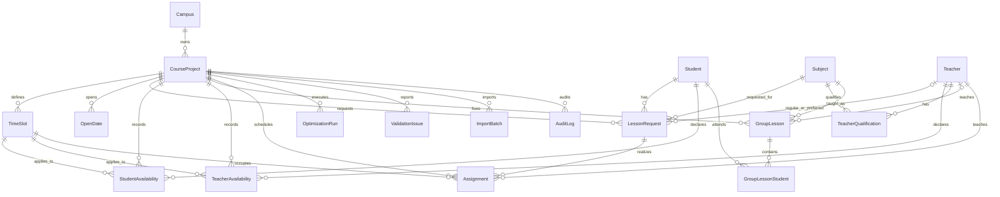
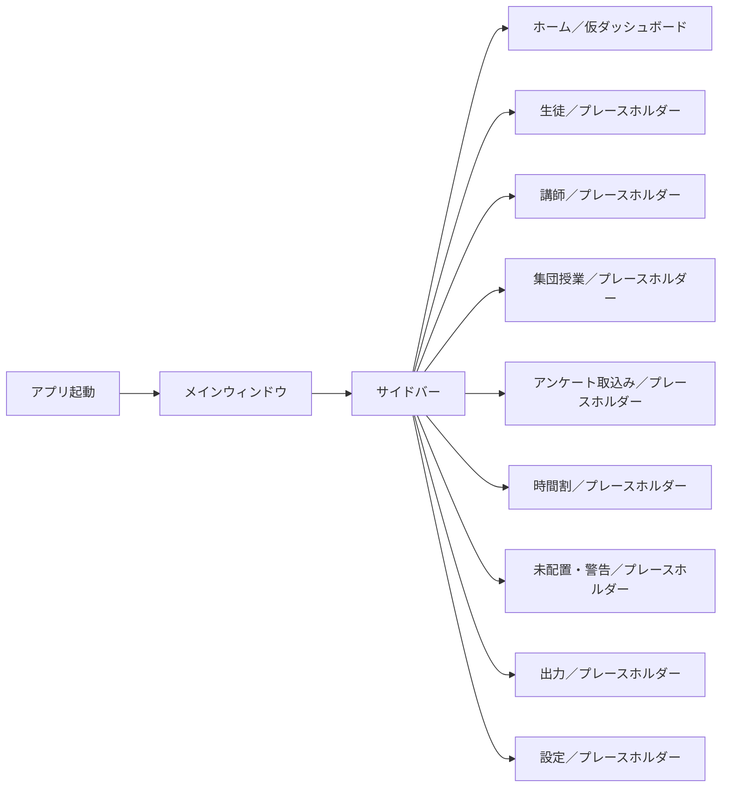

# Phase 0 設計

## 1. 文書の目的と適用範囲

この文書は、初期設計と実装方針をまとめた設計記録である。現在の機能仕様と
ハード制約は[`specification.md`](specification.md)を参照し、本書はそれらを
省略・緩和・変更しない。

本書の実装計画部分は、Phase 0 / 1着手時点の記録である。現在は
Phase 7および`1.0.2`まで実装している。Phase 2で確定した
プロジェクトファイル、マスターの所属範囲、
削除、Excel transactionは
[`ADR 0005`](adr/0005-project-file-and-master-data-lifecycle.md)を参照する。
Phase 3のアンケート・集団授業・入力検証、Phase 4の最適化境界、Phase 5の時間割編集
境界、Phase 6の帳票出力境界、Phase 7のbackup／復旧・版管理・Windows配布境界は
実装済みである。ただし本番Releaseは未公開で、clean Windows、GitHub-hosted workflow、
配布licenseの公開前受入は完了していない。

## 2. 技術構成

| 領域 | 採用技術 | Phase 1 での用途 |
|---|---|---|
| 言語 | Python 3.12 系 | アプリ本体、起動、設定、DB、テスト |
| デスクトップ UI | PySide6 | Windows のローカル GUI |
| UI 記述 | QML / Qt Quick | メインウィンドウ、サイドバー、仮ダッシュボード |
| ORM | SQLAlchemy 2 系 | SQLite 接続と永続化境界 |
| DB | SQLite | 初回起動時に作成するローカル DB |
| マイグレーション | Alembic | スキーマのバージョン管理 |
| 設定 | YAML + PyYAML + platformdirs | 内蔵既定値と利用者別上書き |
| ログ | Python 標準 `logging` | ローカルのローテーションログ |
| テスト | pytest | 単体・結合テスト基盤 |
| lint / format | Ruff | 静的検査と書式 |
| 型検査 | mypy | Python の型検査 |
| CI | GitHub Actions | lint、型検査、test |
| 最適化 | Google OR-Tools CP-SAT `9.14.6206` | Phase 4で候補、制約、辞書式Solve、中断、診断を実装 |
| 時間割編集model | `QAbstractTableModel` + QML `TableView` | Phase 5で当日グリッドを仮想化・再利用表示 |
| Excel | openpyxl | Phase 2 / 3の入出力、Phase 6の編集可能な帳票 |
| PDF | Qt rich text + `QPdfWriter`、QtQuick.Pdf | Phase 6のローカルPDF生成とプレビュー |
| バックアップ・復旧 | SQLite backup API + 原子的置換 | Phase 7の世代管理、整合性検査、復元前退避 |
| Windows standalone | pyside6-deploy + Nuitka 4.0 | Phase 7のportable正本を生成する配布script |
| インストーラー | Inno Setup | 同じstandalone treeの利用者単位install。実機受入は未完了 |
| Release候補 | GitHub Actions + SHA-256 | 品質→build→検査→draft prerelease。タグ・公開は未実施 |

主要判断の理由と影響は [`docs/adr/`](adr/) に記録する。

## 3. 制約の分類

### 3.1 システムとして必須の要件

次は最適化モデルの制約とは別に、アプリ全体が満たす必須要件である。

- Windows 10 / 11 x64 を最優先にする。
- オフラインで動作し、クラウド DB や常時インターネット接続を要求しない。
- UI と利用者向けエラーは日本語とする。
- データ、設定、ログはローカルへ保存する。
- QML に DB 操作、業務ロジック、最適化処理を直接記述しない。
- UI、Application Service、Domain、最適化、Repository、入出力を分離する。
- ORM モデルと最適化モデルを直接密結合させない。
- 個人情報を外部送信せず、テレメトリを入れない。
- 設定値や目的関数の重みをソースコードへ直書きしない。
- 実データ、DB、ログ、入力ファイル、出力ファイルを Git や配布物へ含めない。
- 日本語パス、OneDrive 配下、DPI スケーリング、1366×768 から 4K までを考慮する。
- 保存失敗を明示し、将来のプロジェクト保存では原子的保存または一時ファイル経由を用いる。

### 3.2 時間割最適化におけるハード制約

ハード制約は絶対条件であり、目的関数の改善のために破ってはならない。条件を満たせない授業は `unassigned` として明示する。マスター仕様 17 章の 15 条件をそのまま設計対象とする。

1. 生徒が受講可能な日時である。
2. 講師が出勤可能な日時である。
3. 講師が対象科目を指導可能である。
4. 生徒を同一時刻に重複配置しない。
5. 講師を同一時刻の別枠へ重複配置しない。
6. 同一講師・同一コマの生徒数は最大 2 名とする。
7. `one_to_one_required` の授業は必ず 1 名のみとする。
8. `regular_teacher_priority = 5` は通常担当講師に固定する。
9. 固定済み授業を変更しない。
10. 集団授業と、その担当講師・受講生を重複させない。
11. 生徒の標準または上書きされた最大連続コマ数を超えない。
12. `allow_gap = false` の生徒に空きコマを作らない。
13. `allow_gap = false` の講師に空きコマを作らない。講師の連続担当数そのものには上限を設けない。
14. 開校日・有効コマ以外へ配置しない。
15. LessonRequest の必要回数を超えて割り当てない。

さらに、マスター仕様の各章から次の意味を保持する。

- 通常の生徒は最大連続 2 コマであり、生徒または LessonRequest 単位で一般的に上書きできる。
- コマの連続・空き判定は時刻ではなく `sort_order` を使う。
- 優先度 5 を満たせない場合に別講師へ自動変更しない。
- 1 対 1 必須の生徒と別の生徒を同一講師・同一日時へ同時配置しない。
- 集団授業との衝突は、コマ名の一致ではなく時刻区間の重複で判定する。
- ロック済み Assignment は再最適化でも保持する。
- 必要回数を満たせない場合に備えて未配置変数を持ち、ハード制約違反の解を作らない。

### 3.3 時間割最適化におけるソフト制約

ソフト制約はハード制約を一切緩和しない。単一の雑な重み付き和だけに依存せず、次の順番で辞書式に最適化する。

1. 未配置授業数を最小化する。
2. 優先度 1〜4 と第 1〜第 3 希望講師に基づく講師希望違反を最小化する。優先度 5 はここへ含めずハード制約とする。
3. 稼働する `講師 × 日付 × コマ` の総数を最小化し、可能な範囲で 1 対 2 を増やす。
4. 生徒・講師の希望日時を最大化する。
5. 再最適化時に既存時間割からの変更を最小化する。ロックされていない授業も、前回と同じ日時・講師なら評価する。
6. 任意の追加評価として、期間内の偏り、生徒授業の分散、講師負荷集中、1 名授業を抑える。

各段階の最適値を確定してから次段階へ進み、前段階の最適値を悪化させない制約を追加する。段階内で必要な重みは外部設定に置き、結果には目的関数の内訳を残す。

「1 対 2 の推奨」や「希望日時」はソフト制約であり、受講・出勤可能日時、資格、優先度 5、1 対 1 必須、空きコマ、連続数、固定授業、集団授業などのハード制約を犠牲にしない。

## 4. アーキテクチャ

### 4.1 レイヤーと依存方向

```text
QML UI
  ↓ 画面イベント／表示用状態だけ
ViewModel / Controller
  ↓ ユースケース呼出し
Application Service
  ↓ ドメイン型・ポート
Domain Model / Validation  ←  Optimization（独立した不変入力 DTO）
  ↓ Repository interface
Infrastructure Repository / DB / Excel / PDF / Logging
  ↓
SQLite またはローカルファイル
```

依存は上から下へ向ける。Domain は PySide6、SQLAlchemy、openpyxl、OR-Tools に依存しない。Application は QML の型を受け取らず、画面で必要な変換は ViewModel が担当する。Infrastructure は Domain / Application が定義する境界を実装する。

Phase 1では、起動・設定・DB・ログ・ViewModel・QMLの最小限だけを実装した。Phase 4は
この境界に従い、Application ServiceがORMを不変DTOへコピーし、最適化packageから
SQLAlchemy、QML、QObjectを参照しない。Phase 5も同じ不変最適化DTOと独立validatorを
手動編集previewへ再利用し、QMLへ制約の正本を複製しない。Phase 6ではRepositoryの
読取り結果を`OutputSnapshot`へコピーし、帳票builder、共通レイアウト、Excel /
PDF / CSV rendererをUIとDBから分離する。QMLは`OutputViewModel`だけを通じて
Application Serviceを呼び、帳票本文やファイル生成規則を保持しない。

### 4.2 ディレクトリ構成

```text
.
├─ src/
│  └─ summer_scheduler/
│     ├─ __init__.py
│     ├─ __main__.py
│     ├─ app.py
│     ├─ bootstrap.py
│     ├─ application/                 # Phase 2 以降のユースケース
│     ├─ domain/                      # エンティティ、規則、検証
│     ├─ optimization/                # Phase 4 / 5。最適化と手動編集の不変core
│     ├─ reporting/                   # Phase 6。不変snapshot、帳票builder、共通layout
│     ├─ infrastructure/
│     │  ├─ db/
│     │  │  ├─ base.py
│     │  │  ├─ database.py
│     │  │  ├─ migration_runner.py
│     │  │  ├─ models.py
│     │  │  └─ alembic/
│     │  ├─ repositories/             # Phase 2 以降
│     │  ├─ importing/                # Phase 2 / 3 の Excel / CSV
│     │  ├─ exporting/                # Phase 6 の Excel / PDF / CSVと原子的保存
│     │  └─ logging/
│     │     └─ configuration.py
│     ├─ resources/
│     │  └─ default_settings.yaml
│     ├─ shared/
│     │  └─ settings.py
│     └─ ui/
│        ├─ qml/
│        │  ├─ Main.qml
│        │  ├─ Sidebar.qml
│        │  ├─ DashboardCard.qml
│        │  ├─ DashboardPage.qml
│        │  └─ PlaceholderPage.qml
│        └─ viewmodels/
│           └─ app_view_model.py
├─ tests/
│  ├─ unit/
│  ├─ integration/
│  └─ scenarios/                      # Phase 4 以降
├─ docs/
│  ├─ adr/
│  ├─ reference/
│  ├─ phase0_design.md
│  ├─ specification.md
│  └─ developer_guide.md
├─ .github/workflows/
├─ pyproject.toml
├─ LICENSE
└─ README.md
```

`application`、`domain`、`optimization`、`repositories`、`importing`、`exporting` は責務上の追加先を示す。Phase 1 で不要な機能実装は行わない。

### 4.3 起動時の構成

```text
python -m summer_scheduler
  → app.main()
  → 設定パスを解決し、内蔵 YAML、任意の利用者 YAML、環境変数を読み込む
  → ローカルログを初期化する
  → SQLite の親ディレクトリを作り、Alembic を最新 revision まで適用する
  → SQLAlchemy 接続を確認する
  → QGuiApplication / QQmlApplicationEngine を生成する
  → AppViewModel を appViewModel として QML へ公開する
  → Main.qml を読み込む
```

起動処理が失敗した場合は例外を握り潰さず、可能な範囲で日本語の利用者向けメッセージと技術ログを残す。

## 5. 初期 ER 設計

### 5.1 原則

- マスター仕様 8 章に挙げられた全 18 エンティティを設計対象とし、削除しない。
- ORM エンティティは永続化表現であり、最適化エンジンへ直接渡さない。
- 日付、時刻、列挙値、JSON の表現と制約は Phase 2 の最初のマイグレーションで確定する。
- 外部 ID と表示名を分け、取込みや参照は原則 ID を使う。
- SQLite の外部キー制約を接続ごとに有効化する。
- 監査・履歴が必要な Assignment、OptimizationRun、ImportBatch、AuditLog を通常のマスターと分ける。

### 5.2 関係図



### 5.3 エンティティ一覧とキー案

フィールドの正本はマスター仕様 8 章である。次の表は、そのフィールドを削らずにキーと関係を具体化する初期案である。

| エンティティ | 主キー案 | 主な外部キー・一意性 |
|---|---|---|
| Campus | `id` | 校舎名、任意住所・ロゴ、作成更新日時 |
| CourseProject | `id` | `campus_id → Campus`。講習名、期間、状態、ファイル版 |
| TimeSlot | `id` | `project_id → CourseProject`。`(project_id, code)` を一意。順序と有効状態 |
| OpenDate | `id` | `project_id → CourseProject`。`(project_id, date)` を一意 |
| Student | `id` | `external_id` の一意スコープは未決。氏名、学年、連続数、空き許可、状態 |
| Teacher | `id` | `external_id` の一意スコープは未決。氏名、空き許可、状態 |
| Subject | `id` | 安定した `code` を一意。日本語表示名、学校段階、順序、状態 |
| TeacherQualification | `(teacher_id, subject_id)` | 両方を外部キー。`can_teach` を明示し自動推定しない |
| LessonRequest | `id` | `project_id`、`student_id`、`subject_id`、通常担当と希望 1〜3 の各 `teacher_id`。生徒×科目単位 |
| StudentAvailability | `(project_id, student_id, date, time_slot_id)` | 可否値は 0 / 1 / 2 |
| TeacherAvailability | `(project_id, teacher_id, date, time_slot_id)` | 可否値は 0 / 1 / 2 |
| GroupLesson | `id` | `project_id`、`subject_id`、任意 `teacher_id`。時刻区間を保持 |
| GroupLessonStudent | `(group_lesson_id, student_id)` | 集団授業と受講生の中間表 |
| Assignment | `id` | `project_id`、`lesson_request_id`、`time_slot_id`、`teacher_id`、ロック、手動状態、任意備考。`(lesson_request_id, session_index)` を一意候補 |
| OptimizationRun | `id` | `project_id`。状態、solver 状態、時間上限、目的内訳、件数、ログ |
| ValidationIssue | `id` | `project_id`。severity、種別、対象、再現用詳細、解決状態 |
| ImportBatch | `id` | `project_id`。取込み種別、元ファイル名、件数、列マッピング |
| AuditLog | `id` | `project_id`。時刻、操作、対象、変更前後JSON、理由、操作元、任意operation ID |

`Assignment` は同一講師・同一日時に 2 名を担当する場合も 2 件保持する。未配置は無理な Assignment を作らず、最適化時の未配置変数と結果記録で表す。

Phase 2では、Student、Teacher、Subjectを1 `.jukuschedule`内のスナップショットと
することを決定した。各行に`project_id`を追加せず、1ファイル1CourseProjectという
ファイル境界で所属範囲を定める。`external_id`と科目`code`はファイル内で一意とする。
理由と影響はADR 0005を参照する。

関係図では簡略表示しているが、LessonRequest から Teacher への任意参照は `regular_teacher_id_optional` と `preferred_teacher_1_id_optional`〜`preferred_teacher_3_id_optional` の 4 本をそれぞれ保持する。

### 5.4 マイグレーション方針

- Alembic revision を DB スキーマの唯一の更新経路とする。
- 初回起動も空 DB に対する `upgrade head` として扱う。
- 既存 DB を `create_all()` で暗黙に変更しない。
- revision はレビュー可能な小ささにし、アップグレード時のバックアップ方針を Phase 2 で追加する。
- データ変換を伴う revision は、日本語データ、途中失敗、再実行、旧版からの経路をテストする。
- `.jukuschedule`は1プロジェクトを持つSQLite単一ファイルとし、`file_version`を
  CourseProjectに保持する。migration前snapshotとコピー方式はADR 0005に従う。
- Phase 4のrevision `20260728_0004`はAssignmentとOptimizationRunを追加する。
  projectとLessonRequest、projectとTimeSlotの複合外部キーにより、別プロジェクトの
  参照をDBでも拒否する。入力・結果snapshot、status、目的内訳、経過時間を履歴へ
  保持し、Assignment置換とrun更新を同一transactionで行う。
- Phase 5のrevision `20260729_0005`はAssignmentへ任意備考、AuditLogへ任意理由、
  `system / manual / automatic / undo / redo / import`の操作元、任意operation IDと
  検索indexを追加する。既存監査行はserver default `system`で保持する。
- Phase 6のrevision `20260729_0006`はCourseProjectと1対1の`output_settings`を追加する。
  用紙、向き、表示項目、日数、講師列数、文字、余白、ファイル名規則、既定出力先、
  生徒別改ページ、CSV BOM、色と文字マーカーをプロジェクト単位で保持する。ロゴは
  二重管理せず、既存の`Campus.logo_path_optional`を校舎単位の正本とする。

## 6. Phase 4で実装した最適化モデル

### 6.1 ORM から独立した入力

Application ServiceがRepositoryから取得したデータを、`frozen=True`の最適化入力
DTOへ安定順でコピーする。DTOは安定したID、日付、コマ順序、可能枠、資格、固定状態、
既存配置、注入済み設定を含む。OR-ToolsコードはSQLAlchemy Session、ORMオブジェクト、
QML、QObjectを参照しない。

主な集合は次のとおりとする。

- `R`: LessonRequest
- `I_r`: request `r` の必要回数を表す session index
- `S`: 生徒
- `T`: 講師
- `D`: 開校日
- `K_d`: 日付 `d` で有効なコマ
- `Q`: 科目
- `G`: 集団授業

候補生成段階で、不可日時、未資格、休校日、無効コマ、無効マスター、優先度5の
通常担当講師以外、集団授業の区間重複、固定授業との明白な衝突を除外し、その理由を
診断用に記録する。availabilityの`0`は候補外、`1`と`2`は配置可能とし、`2`は
第4段階の希望日時評価へ反映する。

### 6.2 変数案

| 変数 | 意味 |
|---|---|
| `x[r,i,t,d,k] ∈ {0,1}` | request `r` の `i` 回目を講師 `t`、日付 `d`、コマ `k` に配置 |
| `u[r,i] ∈ {0,1}` | request `r` の `i` 回目が未配置 |
| `student_active[s,d,k] ∈ {0,1}` | 生徒 `s` がその枠で授業を受ける |
| `teacher_active[t,d,k] ∈ {0,1}` | 講師 `t` がその枠で稼働する |
| `student_starts` / `teacher_starts` | 0→1の開始点を数え、同日コマ集合を連続区間にする |
| `preference_violation[...]` | 優先度 1〜4、第 1〜3 希望の違反内訳 |
| `changed[r,i] ∈ {0,1}` | 既存の未ロック配置から日時または講師が変化 |

候補外の `x` は作らない疎なモデルを基本とし、診断では候補を除外した規則を保持する。

### 6.3 制約化の要点（実装済み）

- 各 session について `sum(x) + u = 1` とし、未配置を明示する。
- 生徒・日時ごとの `sum(x) ≤ 1` で重複を防ぐ。
- 講師・日時ごとの `sum(x) ≤ 2` とし、1 対 1 必須がある場合は他 Assignment を 0 にする。
- 資格、受講可能、出勤可能、優先度 5、開校日、有効コマは候補生成と制約の双方で防御する。
- 固定 Assignment は該当する `x = 1`、他候補を 0 とする。入力自体が矛盾する場合は最適化前検証エラーとする。
- 集団授業は `[start_time, end_time)` の区間重複で生徒・講師候補をブロックする。
- 最大連続数は`sort_order`上の長さ`max + 1`の各窓に上限制約を置く。
  LessonRequest上書きが指定されていればStudent標準値より優先する。
- 空きコマ禁止はactive列の0→1開始点の合計を1以下とする。これにより空集合または
  1つの連続区間だけを許す。固定集団授業の占有もactiveへ含める。
- 生徒の`allow_gap_override`が指定されていればStudent標準値より優先する。
  TeacherはTeacher標準値を用いる。
- 講師の担当総数・1 日担当数には上限を加えない。

### 6.4 辞書式最適化の実行

各段階を別Solveとして実行し、候補生成開始からmodel構築、全Solveまでpresetの
単一deadlineを共有する。候補・model構築は安全点で期限を確認し、期限到達を利用者
キャンセルと区別する。独立検証済みincumbentがあれば`FEASIBLE`として復帰し、
なければ`UNKNOWN`としてAssignmentなしで終了する。

候補生成後にハード制約を守るgreedy初期解を構築して独立検証し、CP-SATの全非固定
変数へcomplete hintを渡す。同時刻の重複・容量制約はoccupancy単位へ集約する。
各段階にはincumbentより悪化させないcutoffを設け、検証済みincumbentがある場合は
残り5秒未満で次段を開始しない。各Solveでは最大3秒をsnapshot抽出、独立検証、
診断、返却のために残す。

ある段階が`OPTIMAL`のときだけ整数目的値を等式で固定し、次段階へ進む。
`FEASIBLE`では取得した実行可能snapshotを保持するが、未証明の目的値を固定せず、
後続段階へ進まない。`UNKNOWN`、`INFEASIBLE`、`MODEL_INVALID`ではsolverの変数値を
読まない。

後段Solveが`UNKNOWN`または全体deadline到達となった場合は、直前までに取得した
検証可能なsnapshotを`FEASIBLE`として返す。`INFEASIBLE`または`MODEL_INVALID`は
過去snapshotで隠さない。この規則により、未定義のvalue参照や、未証明目的値を
固定した偽の辞書式最適化を避ける。

目的内訳、乱数seed、時間制限、solver status（`OPTIMAL`、`FEASIBLE`、
`INFEASIBLE`、`UNKNOWN`、`MODEL_INVALID`）をOptimizationRunに記録する。UIを
固めないよう不変DTOだけをQThread workerへ渡し、中止は`CancellationToken`から
`CpSolver.stop_search()`へ伝える。`QThread.terminate()`は使用しない。中止結果は
現在時間割へ保存しない。

### 6.5 未配置理由

モデル構築前の候補除外理由と、配置後に残った競合条件を組み合わせ、マスター仕様
19章の理由分類を再現可能な形で返す。UI向け日本語メッセージと機械可読な
`DiagnosticCode` / detailsを分ける。厳密な最小衝突集合は算出しないが、
単なる「配置不可」だけにはしない。保存前にはsolverとは独立したvalidatorが
session過不足、候補一致、固定、容量、1対1、集団授業、空きコマ、連続上限を再検査する。

### 6.6 Phase 5で実装した手動編集境界

手動編集は、現在の配置と未配置を全sessionの完全partitionとして不変
`EditSchedule`へ変換し、`move / assign_unassigned / unassign`を`EditOperation`として
仮適用する。現在状態と変更後状態の双方をPhase 4の独立result validatorで検査する。

```text
ScheduleBoardDto
  → ScheduleEditorViewModel / QAbstractTableModel
  → EditOperation
  → ScheduleEditService
  → manual_edit.preview_edit()
  → Phase 4 independent result validator
  → Assignment + AuditLog transaction
```

ハード制約違反は赤として拒否し、強制適用経路を設けない。ソフト条件は未配置数、
通常担当、希望講師、希望日時、1対2枠、稼働講師枠、既存配置変更の前後値を比較し、
悪化時は黄として理由付き確認を要求する。悪化がなく配置可能なら緑とする。3判定は
色だけでなくアイコン、安定code、日本語説明を持つ。

操作はAssignmentとAuditLogを1transactionで自動保存する。process内のcommand stackは
before / after snapshotとfingerprintを持ち、Undo / Redo時に現在DBとの一致を確認する。
外部変更を検出した古いcommandは適用しない。差分は新規配置、日時、講師、未配置、
1対1／1対2変化、変更なしをsession単位で返す。

手動保存は即時commit済みDBをSQLite backup APIで整合した明示保存点へ複製し、保存先と
個人情報注意を表示する。別processの強制終了testでcommit済みAssignment / AuditLogは
再接続後も残り、未commitの両方はrollbackされることを確認する。起動時の復旧候補UIと
自動backup世代管理はこのtransaction保証とは別の将来機能である。

再最適化は対象数、ロック数、未配置数を確認し、ProjectServiceのSQLite backupで
checkpointを作った後、既存Phase 4最適化画面へ進む。Phase 4のロックハード制約を
そのまま使うため、最低限の「ロック以外を全体再最適化」を別の弱いsolver経路へ
複製しない。

### 6.7 Phase 6で実装した帳票出力境界

出力は画面に保持した古い行データを直接描画せず、保存またはプレビューの開始ごとに
現在のプロジェクトDBを再読込みする。参照整合性とPhase 4の独立result validatorを
通過した内容だけを、不変の`OutputSnapshot`から帳票へ変換する。

```text
OutputPage.qml
  → OutputViewModel（QThread worker、選択、進捗、上書き確認）
  → OutputService（最新DB再読込み、検証、設定、帳票選択）
  → OutputSnapshot
  → report builder
  → LayoutDocument / raw CSV rows
  → ExcelRenderer / QtPdfRenderer / CsvRenderer
  → 同一ディレクトリの一時ファイル
  → 成功後だけ os.replace
```

`reporting/`はSQLAlchemy、QML、openpyxl、Qtへ依存せず、全体、生徒別、講師別、
未配置・警告を同じ`LayoutDocument`へ構築する。全体帳票は日付数と講師列数で物理
ページを分け、最大2名、1対1、集団授業、休校、ロック、手動変更、警告、未確定を
色と文字マーカーの両方で表す。生データCSVは別の安定した18列schemaを使う。

Excelはopenpyxlで編集可能なbook、印刷範囲、改ページ、繰り返し見出しを構築する。
PDFはHTMLへescapeした共通レイアウトを`QTextDocument`と`QPdfWriter`でローカル描画し、
同じ一時PDFをQtQuick.Pdfでプレビューする。外部ブラウザーやクラウド変換は使用しない。
同名出力は明示確認を要求し、描画、権限、lock、置換失敗時には既存ファイルを保持する。

出力設定のうち用紙等はプロジェクト単位、ロゴだけは校舎単位である。ロゴは5MB以下の
ローカルPNG / JPEGをPDFヘッダーへ埋め込むが、Phase 6のExcelへは画像を埋め込まない。
業務上の参考PDFは個人情報を含む可能性があるため、公開リポジトリ、テストfixture、
配布物へ含めない。帳票は公開仕様の情報構造を実装し、特定資料のピクセル単位の再現は
目的としない。

## 7. 画面構成と遷移

### 7.1 Phase 1 の画面シェル



`Main.qml` が 9 画面のメタデータと選択状態を一元管理し、`Sidebar.qml` の選択 index に応じて `Loader` がホームまたはプレースホルダーを表示する。Phase 2 以降は各項目の `sourceComponent` を専用画面へ置き換える。QML は画面状態を扱うだけで、DB や最適化へ直接アクセスしない。

### 7.2 マスター仕様上の画面との対応

| マスター仕様の画面 | Phase 1 | Phase 7リリース候補の状態 |
|---|---|---|
| プロジェクト選択 | 未実装 | Phase 2の新規・最近使用・開く・別名保存・複製・backupに加え、Phase 7で自動backup、復旧候補、安全な復元、版表示を実装 |
| ダッシュボード | 「ホーム」に仮画面 | Phase 2でプロジェクト概要と主要操作への入口を実装 |
| 生徒管理 | プレースホルダー | Phase 2で一覧・詳細・LessonRequestを実装 |
| 講師管理 | プレースホルダー | Phase 2で一覧・詳細・指導可能科目matrixを実装 |
| アンケート取込み | プレースホルダー | Phase 3でfile、sheet、列mapping、preview、検証、差分、反映を実装 |
| 集団授業 | プレースホルダー | Phase 3で一覧、取込み、受講者、衝突検証を実装 |
| 最適化設定 | 未実装 | Phase 4で30／120／600秒preset、実行・中止・診断を実装 |
| 時間割編集 | プレースホルダー | Phase 5でTableView、DnD、即時検証、lock、Undo / Redo、再最適化を実装 |
| 未配置・警告 | プレースホルダー | Phase 3〜6で入力検証、最適化診断、理由・解決候補、出力を実装 |
| 出力 | プレースホルダー | Phase 6でExcel・PDF・CSV、対象選択、設定、Qt PDF previewを実装 |
| 設定 | プレースホルダー | Phase 2〜6で校舎、コマ、開校日、科目、帳票設定、保存先を実装 |

最適化設定はマスター仕様に独立画面として定義されている一方、指定されたサイドバー
項目には独立項目がない。Phase 1ではサイドバー項目を増減せず、Phase 5では
「時間割」の編集画面からcheckpoint後に簡易最適化画面を開く導線を採用した。

### 7.3 将来の主要業務フロー

```text
プロジェクト選択／新規作成
  → マスター登録（Phase 2）
  → アンケート・集団授業取込みと入力検証（Phase 3）
  → 最適化設定・自動作成・診断（Phase 4）
  → 時間割編集・即時検証・ロック・再最適化（Phase 5）
  → プレビュー・Excel / PDF 出力（Phase 6）
  → backup／復旧・Windows配布候補の受入（Phase 7）
```

各画面は Application Service のユースケースだけを呼び出す。未配置・警告画面は ValidationIssue と最適化診断の読み取りモデル、時間割画面は Assignment の編集用読み取りモデルを利用する。

### 7.4 Phase 2での更新

Phase 2では、Phase 1の9項目サイドバーを維持し、次を実画面へ置き換えた。

- ホーム: 新規、開く、最近使用した一覧、別名保存、複製、バックアップ、クローズ、
  プロジェクト概要
- 生徒: 一覧、検索、学年フィルター、基本情報、LessonRequest
- 講師: 一覧、検索、基本情報、学校段階ごとに折りたためる指導可能科目matrix
- 設定: プロジェクト情報、コマ、開校日・休校日、科目、`master_data.xlsx`

「集団授業」「アンケート取込み」「時間割」「未配置・警告」「出力」は後続Phaseを
明示するプレースホルダーのままである。QMLは`WorkspaceViewModel`のpropertyとslot
だけを利用し、SQLAlchemy Session、openpyxl、業務検証を直接扱わない。

### 7.5 Phase 3 / 4 / 5 / 6 / 7での更新

Phase 3では「集団授業」「アンケート取込み」「未配置・警告」を実画面へ置き換えた。
Phase 4では「時間割」を、自動作成に必要な次の簡易画面へ置き換えた。

- 高速30秒／標準120秒／高品質600秒
- 実行、中止、経過時間、現在段階、solver status
- 配置／未配置件数、目的関数内訳、警告
- 未配置sessionと日本語理由
- 実行ごとの最適化専用ログ保存先

QMLは`OptimizationViewModel`のpropertyとslotだけを利用する。prepareとfinalizeは
Application Service、SolveはDB非依存のQThread workerが担当する。

Phase 5では「時間割」の先頭を`ScheduleEditorPage`へ置き換え、次を追加した。

- 現在日だけをmaterializeする`QAbstractTableModel`とQML `TableView`
- 前日／翌日、日付タブ、カレンダー、日表示、複数日サマリー、拡大縮小
- 授業カード、集団授業、未配置パネル、詳細・差分・履歴
- 配置済み／未配置カードと日付タブのドラッグ＆ドロップ
- Phase 4の同じ候補・独立validatorによる緑／黄／赤preview
- 授業単位lock、Undo / Redo、transaction自動保存、監査
- checkpointを作成して既存OptimizationPageへ進むロック以外の全体再最適化

QMLは`ScheduleEditorViewModel`の表示modelとslotだけを利用する。DB再読込み、候補生成、
制約判定、fingerprint、保存、監査、差分はApplication / Optimization側が担当する。
選択日・選択生徒・選択講師周辺だけの部分再最適化は未実装である。

Phase 6では「出力」を`OutputPage`へ置き換え、全体、生徒別、講師別、未配置・警告、
生データCSVの選択、対象日・講師・生徒、帳票設定、保存先、PDFプレビューを追加した。
ページ送り、50〜300%拡大縮小、幅合わせ、全体表示はQtQuick.Pdfを利用する。生成処理は
QThread workerで実行し、プロジェクト切替guardと一時プレビューのcleanupを行う。
QMLはDB、openpyxl、PDF描画、ハード制約検証を直接扱わない。

Phase 7ではホームへbackup／復旧候補を追加し、project open直後と既定5分間隔の
自動backup、整合性検査、復元前退避、異常終了markerを`ProjectService`へ実装した。
QMLは候補一覧と確認を扱うだけで、SQLite copy、migration、原子的置換を行わない。
Aboutはapp versionとAlembic schema revisionを別項目で表示する。Windows配布もQMLや
Application Serviceへ混在させず、`packaging/`、`scripts/`、`installer/`、
`.github/workflows/release-candidate.yml`へ分離した。

## 8. Phase 1 実装計画（完了済みの履歴）

1. Python 3.12、`src` レイアウト、依存関係、Ruff、mypy、pytest を `pyproject.toml` に定義する。
2. `__main__.py`、`app.py`、`bootstrap.py` を作り、起動順序と終了コードを一か所に集約する。
3. 内蔵 `default_settings.yaml` を読み、`%LOCALAPPDATA%\SummerScheduler\config.yaml` があれば検証して上書きする。
4. `%LOCALAPPDATA%\SummerScheduler\logs\summer_scheduler.log` へ個人情報を含めすぎないローテーションログを出す。
5. SQLAlchemy 2 の engine / session 基盤と Alembic runner を作り、初回起動時に `%LOCALAPPDATA%\SummerScheduler\data\summer_scheduler.db` を作成・更新する。
6. `AppViewModel` だけを QML context の `appViewModel` として公開し、DB 準備状態など表示に必要な値だけを渡す。
7. 日本語タイトル、9 項目のサイドバー、仮ダッシュボード、未実装表示を QML で作る。
8. 設定、パス、DB 初期化、QML 読込み等を、GUI を開かず検証できる単体・結合テストにする。
9. GitHub Actions で Ruff、mypy、pytest を実行する。
10. README、仕様参照、開発者ガイド、ADR、`.gitignore` を実装と整合させる。

Phase 1 の受入確認後に停止し、Phase 2 の指示を待つ。

## 9. リスクと対策

| リスク | 影響 | 現時点の対策 |
|---|---|---|
| QML と Python の境界が肥大化する | UI に業務処理が漏れ、テスト困難になる | QML 公開は ViewModel に限定し、Application Service を経由する |
| ORM と最適化モデルの密結合 | migration が solver を壊し、シナリオテストが重くなる | 読取り専用 DTO へ明示変換し、OR-Tools から Session を参照しない |
| OneDrive 同期と SQLite / ログの競合 | ロック、sidecar、破損、保存失敗 | 既定の稼働データは `%LOCALAPPDATA%` に置く。project open前のlock probe、原子的backup／復元、日本語エラーをPhase 7で実装。実OneDrive競合は公開前手動確認 |
| Alembic 失敗時の部分更新 | 実データが開けなくなる | revision 前バックアップと復旧手順を Phase 2 で追加し、upgrade 経路をテストする |
| 日本語パス・文字コード | 起動、取込み、出力、CI だけで失敗する | `pathlib`、UTF-8、Windows 日本語パスのテストを使う |
| GUI テストの不安定さ | CI で QML 起動が再現しない | ロジックを GUI 外でテストし、QML smoke test は offscreen で最小化する |
| 全日×40講師のQML Item膨張 | スクロール・日付切替でUIが固まる | 現在日だけを5×講師数の`QAbstractTableModel`へmaterializeし、TableView delegateを再利用。40講師×5コマ×20日・1,000カードのmodel回帰とWindows手動確認を分ける |
| Undoが外部変更を上書きする | 別操作や再最適化結果を失う | commandへbefore/after fingerprintを持たせ、DB不一致時は拒否・履歴破棄。逆操作もtransactionとAuditLogへ保存 |
| DnD previewと保存時判定がずれる | preview後の変更でハード違反を保存する | 同じPython coreとPhase 4 validatorをpreview時と保存transaction内で再実行し、redの強制経路を設けない |
| 辞書式Solveの計算時間 | 最大6段階で時間上限を超える | 単一deadline、greedy incumbent、complete hint、段階cutoff、5秒の次段開始閾値、最大3秒の返却余白を実装。高速30秒は27.179秒、標準120秒は117.939982秒で、ともに`FEASIBLE`・時間内。全段階`OPTIMAL`は保証しない |
| 空きコマ制約がモデルを大型化する | 1000件規模で性能低下 | `sort_order`上のstart変数で一般化し、重複制約をoccupancy単位へ集約。既定規模は候補73,440件、配置1,042件／未配置8件。memoryは`--trace-memory`時の参考測定だけとする |
| 診断と solver の判定がずれる | 未配置理由の信頼性が下がる | 候補除外理由を機械可読に保持し、シナリオテストで再現性を検証する |
| 参考 PDF に個人情報がある | Git やテスト成果物から漏えいする | PDF を実行時依存にせず Git 対象外とし、テストは架空データだけを使う |
| Excel / PDFで内容・改ページがずれる | 同じ時間割でも帳票ごとに解釈が変わる | 不変`LayoutDocument`を共有し、rendererは表示形式だけを担当する |
| 出力失敗で既存ファイルを壊す | 業務成果物を失う | 同一directoryの一時ファイルへ生成し、成功後だけ原子的に置換する |
| 過密なPDF設定で文字が読めない | 出力は成功しても業務利用できない | 最小文字サイズを下回る設定を明示エラーにし、日数・講師列数の調整を求める |
| 配布時の QML / migration resource 欠落 | 開発環境では動くが配布物で起動しない | pyside6-deploy／Nuitkaのstandalone treeをportable／installerの共通正本とし、内容検査とPythonをPATHから外すsmokeをscript／CIへ追加。clean Windows実行は未確認 |
| 配布licenseまたは実データ混入 | 公開停止、権利侵害、個人情報漏えい | runtime license収集と配布treeの禁止pattern検査を行う。GPL-3.0-onlyのLICENSE、Qt完成artifact、Inno条件の確認まで本番Releaseを停止 |

## 10. 未決事項

Phase 0時点の未決事項を次に示す。解決した項目には状態を付記する。

1. **Phase 2で解決**: Student、Teacher、Subjectは`.jukuschedule`ごとの
   スナップショットとする。
2. **Phase 2で解決**: `external_id`とSubject `code`はファイル内で一意とする。
3. **Phase 2で解決**: `.jukuschedule`はSQLite単一ファイルとする。
4. **Phase 4で解決**: LessonRequestのnullableな上書きが指定されていればStudentの
   標準値より優先し、nullならStudentの値を使う。`allow_gap`と最大連続数の両方へ
   適用する。
5. **Phase 4で解決**: 優先度1〜4、通常担当、第1〜第3希望は設定ファイルの整数weight
   で同一段階に評価する。同一講師が複数区分へ現れる場合は最大点だけを採用し、
   重複加点しない。
6. **Phase 4で解決**: 全段階で単一deadlineを共有する。前段が`OPTIMAL`のときだけ
   目的値を固定して後続へ進み、`FEASIBLE`ではsnapshotを保持して停止する。
   `UNKNOWN`ではvalueを読まず、直前の検証可能snapshotがあれば復帰する。
7. **Phase 5で解決**: 管理者強制経路は実装せず、すべてのハード制約違反を拒否する。
   将来強制機能を追加する場合も、マスター仕様との整合、明示確認、理由、AuditLogを
   新しいADRで決める。
8. **Phase 5で表示単位を解決**: 集団授業は半開区間が重なる各コマの担当講師セルへ
   group blockとして表示する。詳細な衝突理由はPhase 4の独立validator codeを使う。
9. **Phase 6でも未解決**: 指定された正確な参考PDFが存在しないため、直接比較できない。
   別名PDFは個人情報を含む可能性があり開いていない。個人情報を除去した見本または
   合意済み仕様が得られた時点でレイアウト詳細を確認する。
10. **Phase 6で解決**: PDFはQt rich textと`QPdfWriter`による完全ローカル描画を採用し、
    QtQuick.Pdfで同じ一時PDFをプレビューする。判断と制約はADR 0008に記録した。
11. **Phase 4で解決**: 不変DTOだけをQThread workerへ渡す。
    `CancellationToken`と`CpSolver.stop_search()`で協調的に中止し、
    `QThread.terminate()`は使用しない。
12. **Phase 7で技術方式を解決、公開前受入は継続**: pyside6-deployからNuitka 4.0の
    standalone directoryを作り、同じtreeをportable ZIPとInno Setup installerへ使う。
    内容検査、SHA-256、SmartScreen注意、unsigned境界を実装した。完成成果物の
    clean Windows実行、installer upgrade／uninstall、GitHub-hosted workflowは
    `NOT TESTED`のまま公開前に確認する。
13. セル、日付、講師、選択範囲単位の一括lockと、選択日・選択生徒・選択講師周辺の
    部分再最適化。Phase 5の必須範囲は授業単位lockとロック以外の全体再最適化で完了し、
    部分境界を偽実装しない。
14. Undo / Redo履歴のアプリ再起動をまたぐ復元。Phase 5はprocess内stackと永続
    AuditLogを分け、再起動後に監査ログをcommandとして自動再生しない。
15. **Phase 7で公開停止条件として明確化**: プロジェクト自身はGPL-3.0-onlyを
    採用した。Qt Community Editionの対応ソース・notice、Inno Setupの利用条件と
    SignPath署名対象の適格性は配布責任者が確認する。技術的なbuild成功だけで
    本番公開しない。

これらを決める際にも、マスター仕様のハード制約をソフト化したり、対象機能を削除したりしない。
